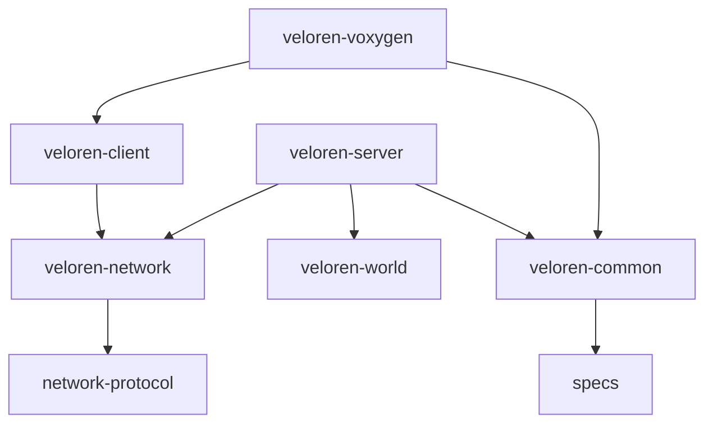

# Veloren 專案架構分析報告

本報告深入拆解 Veloren 遊戲的軟體架構、模組依賴關係以及核心技術選型。

## 1. 宏觀架構 (High-Level Topology)

Veloren 採用典型的 **Client-Server (C/S)** 架構，並透過高度模組化的 Rust Workspace 實現。其核心驅動模式為 **ECS (Entity Component System)**。

### 1.1 模組依賴圖 (Mermaid)

## 2. 核心模組職責說明

### 2.1 veloren-common (核心邏輯層)
- **職責**：存放遊戲世界的「真理」。包括所有組件（Components）、物理計算、天氣算法、時間系統。
- **關鍵點**：不包含任何渲染代碼，確保可以在無頭伺服器（Headless Server）上執行。

### 2.2 veloren-server (權威伺服器)
- **職責**：維護遊戲世界的最終狀態，處理玩家連接，執行 AI 行為，並負責數據持久化（SQLite）。
- **組件**：包含 `server-agent` 處理 NPC 邏輯。

### 2.3 veloren-voxygen (圖形前端)
- **職責**：將 `common` 與 `client` 的數據轉化為視覺與聽覺體驗。
- **技術棧**：
    - **渲染**：`wgpu` (跨平台 API)。
    - **UI**：混合使用 `egui` (調試與某些介面) 與 `iced`/`conrod`。
    - **分配器**：在 Windows 上強制使用 `mimalloc` 以優化內存表現。

### 2.4 veloren-world (世界生成)
- **職責**：負責地圖生成、生物群系分佈、城鎮生成與基礎經濟模擬。
- **特點**：運算密集度極高，通常在專用的 `no_overflow` Profile 下編譯。

### 2.5 veloren-network (網路傳輸)
- **職責**：基於 `quinn` 實現 QUIC 協議，處理封包壓縮、加密與可靠性傳輸。

## 3. 核心技術模式

### 3.1 ECS 模式 (Entity Component System)
專案使用 `specs` 框架。
- **Entity**: 唯一的 ID。
- **Component**: 純數據（如 `Position`, `Health`）。
- **System**: 行為邏輯（如 `PhysicsSystem`, `CombatSystem`）。
這使得 Veloren 能夠在單執行緒或多執行緒中高效處理數萬個實體。

### 3.2 熱重載 (Hot Reloading)
透過 `assets_manager` 與自定義監控，Veloren 支持在不重啟遊戲的情況下修改資產（RON 檔案）、著色器（Shaders）甚至是部分邏輯。

## 4. 數據流向 (Data Flow)

1. **Input**: `voxygen` 捕獲鍵盤鼠標事件 -> 轉換為 `Command`。
2. **Network**: `client` 將 `Command` 透過 `network` 傳送到 `server`。
3. **Simulation**: `server` 的 ECS Systems 處理 `Command`，更新 `common` 中的狀態。
4. **Sync**: `server` 將狀態差異（State Diff）廣播回 `client`。
5. **Render**: `voxygen` 接收 Diff，更新本地預測狀態，並由渲染系統繪製。

---
*本報告由 Gemini CLI 分析生成，用於輔助架構理解。*
